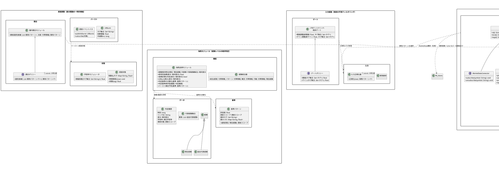

```plantuml
@startuml
' —— レイアウト調整 ——
top to bottom direction
skinparam packageStyle rectangle
skinparam ranksep 25
skinparam nodesep 15
skinparam classAttributeIconSize 0

'========================================
package "分散自律層ネットワーク" as P1 {

  package "層" as P1_Layers {

    interface 自律層<T extends 付帯文脈> {
      +期待パターン生成(宛先ID: String, 文脈: 付帯情報<T>): 期待パターン<T>
      +実際パターン観測(実際: 実際パターン<T>)
      +予測モデル更新(信号: 学習信号<T>)
    }

    class 感覚自律層 {
    }

    class パターン自律層 {
    }

    class 概念自律層 {
    }

    class 行動自律層 {
    }

    自律層 <|.. 感覚自律層
    自律層 <|.. パターン自律層
    自律層 <|.. 概念自律層
    自律層 <|.. 行動自律層
  }

  package "層間リンク" as P1_Links {

    class 層間相対判定リンク<T extends 付帯文脈> {
      +相対差分計算(期待: 期待パターン<T>, 実際: 実際パターン<T>): 相対差分<T>
      +学習率調整(差分: 相対差分<T>, 文脈: 付帯情報<T>): 適応学習率
      +更新範囲決定(差分: 相対差分<T>, 文脈: 付帯情報<T>): 更新スコープ
      +計算スキップ判定(差分: 相対差分<T>): スキップEnum
    }

    enum スキップEnum {
      部分更新
      完全スキップ
      集中計算
    }

    interface 学習率ポリシー<T extends 付帯文脈> {
      +学習率(差分: 相対差分<T>, 文脈: 付帯情報<T>): 適応学習率
    }

    interface 更新範囲ポリシー<T extends 付帯文脈> {
      +範囲(差分: 相対差分<T>, 文脈: 付帯情報<T>): 更新スコープ
    }

    interface スキップポリシー<T extends 付帯文脈> {
      +スキップ判定(差分: 相対差分<T>): スキップEnum
    }
  }

  package "メトリクス" as P1_Metrics {

    interface 差分距離メトリクス<T extends 付帯文脈> {
      +距離(期待: 期待パターン<T>, 実際: 実際パターン<T>): float
    }

    enum 距離メトリクス種別 {
      L2
      コサイン
      KL
      EMD
    }

    class 距離メトリクスFactory {
      +resolve(kind: 距離メトリクス種別): 差分距離メトリクス
    }

    class L2距離 {
    }

    class コサイン距離 {
    }

    class KL距離 {
    }

    class EMD距離 {
    }

    差分距離メトリクス <|.. L2距離
    差分距離メトリクス <|.. コサイン距離
    差分距離メトリクス <|.. KL距離
    差分距離メトリクス <|.. EMD距離
  }
}

'========================================
package "値オブジェクト群 / インデックス" as P2 {

  package "タグ文脈" as P2_Context {

    enum タグ種別 {
      時刻
      文字列
      数値
    }

    class タグ {
      種別: タグ種別
      キー: String
      時刻値: long
      文字列値: String
      数値値: double
    }

    interface 付帯文脈 {
    }

    class 付帯情報<T extends 付帯文脈> {
      タグ集合: Set<タグ>
      統計情報: Map<String, float>
      本体: T
    }
  }

  package "パターン差分" as P2_PatternDelta {

    class 期待パターン<T extends 付帯文脈> {
    }

    class 実際パターン<T extends 付帯文脈> {
    }

    class 相対差分<T extends 付帯文脈> {
      大きさ: float
      付帯情報: 付帯情報<T>
    }
  }

  package "学習信号" as P2_LearnSignal {

    class 適応学習率 {
      値: float
      由来: String
    }

    class 更新スコープ {
      パラメータID集合: Set<String>
      マスク: String
      インデックス範囲: String
    }

    class 学習信号<T extends 付帯文脈> {
      適応学習率: 適応学習率
      参照差分: 相対差分<T>
      更新対象: 更新スコープ
    }
  }

  package "索引" as P2_Index {

    class リンクインデックス<T extends 付帯文脈> {
      byTime: Map<long,   List<層間相対判定リンク<T>>>
      byString: Map<String, List<層間相対判定リンク<T>>>
      byNumber: Map<double, List<層間相対判定リンク<T>>>
      +登録(タグ: タグ, link: 層間相対判定リンク<T>)
      +取得(タグ: タグ): List<層間相対判定リンク<T>>
    }
  }
}

'========================================
package "入力経路（視床の予測フィルタリング）" as P3 {

  package "入力" as P3_Input {

    class 感覚器官 {
    }

    class 入力正規化器<T extends 付帯文脈> {
      +正規化(raw): 実際パターン<T>
    }
  }

  package "ゲート" as P3_Gate {

    class 視床ゲート <<予測フィルタリング>> {
      +閾値調整(新閾値: float, タグ集合: Set<タグ>)
      +ゲイン調整(新ゲイン: float, タグ集合: Set<タグ>)
    }

    interface ゲートポリシー {
      +閾値(タグ集合: Set<タグ>): float
      +ゲイン(タグ集合: Set<タグ>): float
    }

    視床ゲート o-- ゲートポリシー
  }
}

'========================================
package "海馬モジュール（経験レベルの相対判定）" as P4 {

  package "データ" as P4_Data {

    class 経験 {
    }

    class 過去代表経験 {
    }

    class 現在経験 {
    }

    class 代表経験集合 {
      要素: List<過去代表経験>
    }

    class 判定履歴 {
      時刻: long
      リンクID: String
      差分: 相対差分
      学習率: 適応学習率
      更新対象: 更新スコープ
    }

    経験 <|-- 過去代表経験
    経験 <|-- 現在経験
  }

  package "基準" as P4_Basis {

    class 基準パターン {
      許容差: float
      更新スコープ: 更新スコープ
      着目タグ: Set<String>
      重みづけ: Map<String, float>
      +適用(現在: 現在経験): 更新スコープ
    }
  }

  package "機能" as P4_Function {

    class 経験統合器 {
      +統合(感覚: 付帯情報, パターン: 付帯情報, 概念: 付帯情報, 行動: 付帯情報): 現在経験
    }

    class 海馬自律モジュール {
      +経験相対照合(現在: 現在経験, 代表群: 代表経験集合): 相対差分
      +新奇性指標(差分: 相対差分): float
      +長期記憶化判定(差分: 相対差分): bool
      +LRBurst発火(差分: 相対差分)
      +判定基準の分散化(基準: 基準パターン)
      +判定基準再学習(履歴: 判定履歴)
      +バースト暴走予防(基準: 基準パターン)
    }
  }
}

'========================================
package "感度調整（差分駆動の一時的増幅）" as P5 {

  package "バースト" as P5_Burst {

    class LRBurst {
      タグ集合: Set<String>
      初期増幅: float
      半減期ms: long
    }

    class 感度イベントバス {
      +publish(burst: LRBurst)
      +subscribe(対象)
    }
  }

  package "状態" as P5_State {

    class 感度状態 {
      係数Byタグ: Map<String, float>
      +時間更新(now): void
      +係数(tag): float
    }

    class 学習率モジュレータ {
      +増幅係数(タグ集合: Set<String>): float
    }
  }

  package "競合" as P5_Compete {

    class 層内競合モジュール {
      +勝者選択(候補: List<期待パターン>, 文脈: 付帯情報): 期待パターン
    }

    interface 競合ポリシー<T extends 付帯文脈> {
      +選択(候補: List<期待パターン<T>>): 期待パターン<T>
    }

    層内競合モジュール o-- 競合ポリシー
  }
}

'========================================
package "外界I/O（行動→環境→感覚/自己受容）" as P6 {

  package "行動" as P6_Action {

    class 行動実行器<T extends 付帯文脈> {
      +実行(期待: 期待パターン<T>): void
    }

    class 運動予測コピー送出器<T extends 付帯文脈> {
      +送出(期待: 期待パターン<T>, タグ集合: Set<タグ>)
    }
  }

  package "環境" as P6_Env {

    class 外界 {
    }

    class 実行結果パターン<T extends 付帯文脈> {
    }

    class 実行結果キャプチャ<T extends 付帯文脈> {
      +取得(): 実行結果パターン<T>
    }

    ' 注記: 実行結果パターン は 実際パターン の特化概念
    note right of 実行結果パターン
      モデル上は 実際パターン<T> の一種。
      交差矢印を減らすためリンクは省略。
    end note
  }
}

'========================================
package "実行基盤（イベント＋層ごとフレーム）" as P7 {

  package "イベント" as P7_Event {

    enum 優先度 {
      高
      中
      低
    }

    class 更新イベント<T extends 付帯文脈> {
      発生時刻: long
      優先度: 優先度
      対象リンクID: String
      差分: 相対差分<T>
    }

    class イベントキュー<T extends 付帯文脈> {
      +push(e: 更新イベント<T>)
      +pull(): 更新イベント<T>
      +サイズ(): int
    }

    class バックプレッシャ制御 {
      +水位監視(): void
      +ドロップor劣化処理方針(): void
    }
  }

  package "フレーム" as P7_Frame {

    class 制御フレームタイマ {
      +登録(層ID: String, 周期ms: int): void
      +tick(): List<String>
    }

    class 層リズム設定 {
      感覚自律層_ms: int
      パターン自律層_ms: int
      概念自律層_ms: int
      行動自律層_ms: int
      海馬_ms: int
    }

    class 層実行スケジューラ<T extends 付帯文脈> {
      +即時処理(大差分: 更新イベント<T>): void
      +フレーム処理(層ID: String): void
    }

    層実行スケジューラ o-- イベントキュー
    層実行スケジューラ o-- 制御フレームタイマ
    制御フレームタイマ o-- 層リズム設定
  }

  package "統合介入" as P7_Integrate {

    interface Δ統合ポリシー {
      +統合(差分群: List<相対差分>, 文脈: 付帯情報): 相対差分
    }

    class リンクアグリゲータ<T extends 付帯文脈> {
      +収集(上位ID: String): List<層間相対判定リンク<T>>
    }

    interface 驚愕閾値ポリシー<T extends 付帯文脈> {
      +トリガ?(差分: 相対差分<T>): bool
    }

    class 緊急介入ハンドラ {
      +海馬即時介入(差分: 相対差分): void
      +視床強制ゲート変更(タグ集合: Set<タグ>): void
    }

    class 差分履歴バッファ {
      +追加(差分: 相対差分, 学習率: 適応学習率): void
      +取得(期間: long): List<相対差分>
    }

    interface 適応可能ポリシー {
      +update(履歴: 差分履歴バッファ): void
    }

    class 学習率メタ学習器 {
      +学習(履歴: 差分履歴バッファ, 目標: 学習率ポリシー): void
    }

    学習率ポリシー ..|> 適応可能ポリシー
  }
}

' === ここからパッチ：P8 に MCP/Connectors を追加（疎結合） ===

package "ユーザIF/運用" as P8 {

  package "連携(MCP/Connectors)" as P8_MCP {

    interface Connector {
      +id(): String
      +kind(): String         ' "trading" | "notifier" | "marketdata" など
      +tags(): Set<タグ>
    }

    interface TradingConnector extends Connector {
      +placeOrder(req: OrderRequest): OrderResponse
      +closeAll(symbol: String): OrderResponse
      +positions(): String
      +signal(msg: String): void
    }

    interface NotifierConnector extends Connector {
      +notify(msg: String): void
    }

    interface MarketDataConnector extends Connector {
      +subscribe(symbol: String): void
      +unsubscribe(symbol: String): void
    }

    class MCPClient {
      +handshake(): List<CapabilityDescriptor>
      +invoke(toolName: String, argsJson: String): String
      +subscribe(eventName: String): void
    }

    class CapabilityDescriptor {
      name: String            ' 例: "order.place"
      version: String
      inputSchema: String     ' JSON Schema (文字列で保持)
      outputSchema: String
      付帯タグ: Set<タグ>
    }

    class ConnectorRegistry {
      +register(c: Connector): void
      +resolve(kind: String, tags: Set<タグ>): Connector
      +byTag(tag: タグ): List<Connector>
    }

    class MCPToolBinding {
      domainOp: String        ' 例: "placeOrder"
      toolName: String        ' 例: "order.place"
      inputMapping: String    ' JSONPath/テンプレ
      outputMapping: String
    }

    class ExecutionRouter {
      +routeOrder(profile: StrategyProfile, req: OrderRequest): TradingConnector
      +routeNotify(tags: Set<タグ>): NotifierConnector
      +routeMarket(tags: Set<タグ>): MarketDataConnector
    }

    class OrderRequest {
      symbol: String
      side: String            ' "buy" | "sell"
      volume: double
      price: double
      sl: double
      tp: double
      timeInForce: String
      tags: Set<タグ>
    }

    class OrderResponse {
      orderId: String
      status: String          ' accepted/filled/rejected 等
      filled: double
      message: String
    }

    class AuthCredential {
      kind: String            ' "Bearer" | "APIKey" | ...
      value: String
    }

    class CredentialVault {
      +get(connectorId: String): AuthCredential
      +put(connectorId: String, cred: AuthCredential): void
    }

    ' --- 参考実装（外部にある前提のモック型；任意） ---
    class MQLTradingConnector {
      endpoint: String
    }
    TradingConnector <|.. MQLTradingConnector

    class LineNotifyConnector {
      tokenAlias: String
    }
    NotifierConnector <|.. LineNotifyConnector

  }

}


'========================================
' パッケージ間の高粒度の関係（クラス同士の細かい矢印は省略）
P1_Links ..> P1_Metrics : 距離選択/Factory
P1_Links ..> P2_PatternDelta : 期待/実際/差分
P1_Links ..> P2_LearnSignal : 学習率/更新スコープ/学習信号
P1_Layers ..> P1_Links : 上下を結ぶ相対判定
P1_Layers ..> P2_Index : 複数リンクの探索
P3_Gate ..> P3_Input : 正規化/入力受容
P4_Function ..> P4_Data : 経験/履歴を参照
P4_Function ..> P4_Basis : 基準の分散化
P5_Burst ..> P5_State : バースト→感度状態
P5_Compete ..> P2_PatternDelta : 期待パターンを選択
P6_Action ..> P6_Env : 行動→外界→結果
P7_Event ..> P1_Links : Δイベント発火
P7_Frame ..> P1_Layers : フレーム駆動の更新
P7_Integrate ..> P1_Links : Δ統合/介入
P7_Integrate ..> P2_LearnSignal : 履歴/メタ学習
P8_MCP ..> P8_Commands : 運用コマンドからの実行委譲
P8_MCP ..> P8_Alerts   : 通知経路（Line など）を疎結合で
P8_MCP ..> P6_Action   : 取引I/Oを外部コネクタへブリッジ
P8_MCP ..> P3_Input    : MarketData購読（任意）

' —— 縦並びのための隠し矢印 ——
P1 -[hidden]down-> P2
P2 -[hidden]down-> P3
P3 -[hidden]down-> P4
P4 -[hidden]down-> P5
P5 -[hidden]down-> P6
P6 -[hidden]down-> P7

@enduml

```