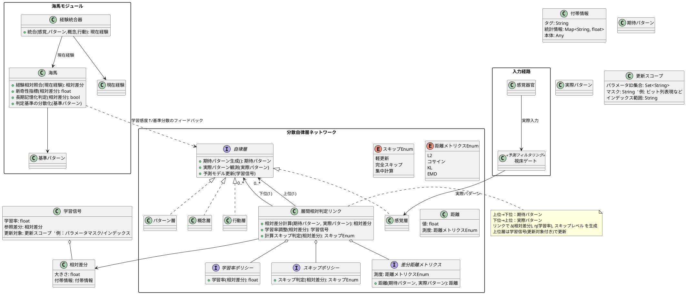

```plantuml
@startuml
skinparam packageStyle rectangle

package "分散自律層ネットワーク" {
  interface 自律層 {
    +期待パターン生成(): 期待パターン
    +実際パターン観測(実際パターン)
    +予測モデル更新(学習信号)
  }

  class 感覚層
  class パターン層
  class 概念層
  class 行動層

  自律層 <|.. 感覚層
  自律層 <|.. パターン層
  自律層 <|.. 概念層
  自律層 <|.. 行動層
  
  enum スキップEnum {
    軽更新
    完全スキップ
    集中計算
  }

  enum 距離メトリクスEnum {
    L2
    コサイン
    KL
    EMD
  }
   
  class 距離 {
    値: float
    測度: 距離メトリクスEnum
  }

  ' 層間の関係（相対判定の主体）
  class 層間相対判定リンク {
    +相対差分計算(期待パターン, 実際パターン): 相対差分
    +学習率調整(相対差分): 学習信号
    +計算スキップ判定(相対差分): スキップEnum
  }

  ' リンクが参照する戦略（差し替え可能）
  interface 差分距離メトリクス {
    +距離(期待パターン, 実際パターン): 距離
    測度: 距離メトリクスEnum
  }
  interface 学習率ポリシー {
    +学習率(相対差分): float 
  }
  interface スキップポリシー {
    +スキップ判定(相対差分): スキップEnum
  }

  層間相対判定リンク o-- 差分距離メトリクス
  層間相対判定リンク o-- 学習率ポリシー
  層間相対判定リンク o-- スキップポリシー

  ' 多重度と役割
  自律層 "0..*" <-- 層間相対判定リンク : 上位(1)
  自律層 "0..*" <-- 層間相対判定リンク : 下位(1)
}

class 付帯情報 {
  タグ: String
  統計情報: Map<String, float>
  本体: Any
}

' 値オブジェクト群
class 期待パターン
class 実際パターン
class 相対差分 {
  大きさ: float
  付帯情報: 付帯情報
}
class 更新スコープ {
  パラメータID集合: Set<String>
  マスク: String  ' 例: ビット列表現など
  インデックス範囲: String
}
class 学習信号 {
  学習率: float
  参照差分: 相対差分
  更新対象: 更新スコープ  ' 例：パラメータマスク/インデックス
}

' 感覚入力の起点（本文の視床/感覚器官）
package "入力経路" {
  class 感覚器官
  class 視床ゲート <<予測フィルタリング>>
  感覚器官 --> 視床ゲート : 実際入力
  視床ゲート --> 感覚層 : 実際パターン
}

' 海馬は独立モジュールとして扱う
package "海馬モジュール" {
  class 経験統合器 {
    +統合(感覚,パターン,概念,行動): 現在経験
  }
  class 海馬 {
    +経験相対照合(現在経験): 相対差分
    +新奇性指標(相対差分): float
    +長期記憶化判定(相対差分): bool
    +判定基準の分散化(基準パターン)
  }
  class 現在経験
  class 基準パターン

  経験統合器 --> 現在経験
  経験統合器 --> 海馬 : 現在経験
  海馬 --> 基準パターン
  海馬 ..> 自律層 : 学習感度↑/基準分散のフィードバック
}

note right of 層間相対判定リンク
上位→下位：期待パターン
下位→上位：実際パターン
リンクで Δ(相対差分), η(学習率), スキップレベル を生成
上位層は学習信号(更新対象付き)で更新
end note

' 依存関係（@enduml の内側に置く）
学習信号 o-- 相対差分
層間相対判定リンク --> 相対差分
@enduml

```