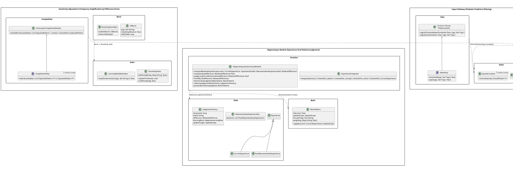

```plantuml
@startuml
' -- Layout Adjustments --
top to bottom direction
skinparam packageStyle rectangle
skinparam ranksep 25
skinparam nodesep 15
skinparam classAttributeIconSize 0

'========================================
package "Distributed Autonomous Layer Network" as P1 {

  package "Layers" as P1_Layers {

    interface AutonomousLayer<T extends Context> {
      +generateExpectedPattern(destinationID: String, context: ContextInfo<T>): ExpectedPattern<T>
      +observeActualPattern(actual: ActualPattern<T>)
      +updatePredictiveModel(signal: LearningSignal<T>)
    }

    class SensoryAutonomousLayer {
    }

    class PatternAutonomousLayer {
    }

    class ConceptAutonomousLayer {
    }

    class ActionAutonomousLayer {
    }

    AutonomousLayer <|.. SensoryAutonomousLayer
    AutonomousLayer <|.. PatternAutonomousLayer
    AutonomousLayer <|.. ConceptAutonomousLayer
    AutonomousLayer <|.. ActionAutonomousLayer
  }

  package "Inter-Layer Links" as P1_Links {

    class InterLayerRelativeJudgementLink<T extends Context> {
      +calculateRelativeDifference(expected: ExpectedPattern<T>, actual: ActualPattern<T>): RelativeDifference<T>
      +adjustLearningRate(difference: RelativeDifference<T>, context: ContextInfo<T>): AdaptiveLearningRate
      +determineUpdateScope(difference: RelativeDifference<T>, context: ContextInfo<T>): UpdateScope
      +judgeCalculationSkip(difference: RelativeDifference<T>): SkipEnum
    }

    enum SkipEnum {
      PartialUpdate
      FullSkip
      FocusedCalculation
    }

    interface LearningRatePolicy<T extends Context> {
      +learningRate(difference: RelativeDifference<T>, context: ContextInfo<T>): AdaptiveLearningRate
    }

    interface UpdateScopePolicy<T extends Context> {
      +scope(difference: RelativeDifference<T>, context: ContextInfo<T>): UpdateScope
    }

    interface SkipPolicy<T extends Context> {
      +judgeSkip(difference: RelativeDifference<T>): SkipEnum
    }
  }

  package "Metrics" as P1_Metrics {

    interface DifferenceDistanceMetric<T extends Context> {
      +distance(expected: ExpectedPattern<T>, actual: ActualPattern<T>): float
    }

    enum DistanceMetricType {
      L2
      Cosine
      KL_Divergence
      EMD
    }

    class DistanceMetricFactory {
      +resolve(kind: DistanceMetricType): DifferenceDistanceMetric
    }

    class L2Distance {
    }

    class CosineDistance {
    }

    class KLDivergence {
    }

    class EMDDistance {
    }

    DifferenceDistanceMetric <|.. L2Distance
    DifferenceDistanceMetric <|.. CosineDistance
    DifferenceDistanceMetric <|.. KLDivergence
    DifferenceDistanceMetric <|.. EMDDistance
  }
}

'========================================
package "Value Objects / Index" as P2 {

  package "Tag Context" as P2_Context {

    enum TagType {
      Timestamp
      String
      Number
    }

    class Tag {
      type: TagType
      key: String
      timestampValue: long
      stringValue: String
      numberValue: double
    }

    interface Context {
    }

    class ContextInfo<T extends Context> {
      tags: Set<Tag>
      statistics: Map<String, float>
      body: T
    }
  }

  package "Pattern Difference" as P2_PatternDelta {

    class ExpectedPattern<T extends Context> {
    }

    class ActualPattern<T extends Context> {
    }

    class RelativeDifference<T extends Context> {
      magnitude: float
      contextInfo: ContextInfo<T>
    }
  }

  package "Learning Signal" as P2_LearnSignal {

    class AdaptiveLearningRate {
      value: float
      origin: String
    }

    class UpdateScope {
      parameterIds: Set<String>
      mask: String
      indexRange: String
    }

    class LearningSignal<T extends Context> {
      adaptiveLearningRate: AdaptiveLearningRate
      referenceDifference: RelativeDifference<T>
      updateTarget: UpdateScope
    }
  }

  package "Index" as P2_Index {

    class LinkIndex<T extends Context> {
      byTime: Map<long,   List<InterLayerRelativeJudgementLink<T>>>
      byString: Map<String, List<InterLayerRelativeJudgementLink<T>>>
      byNumber: Map<double, List<InterLayerRelativeJudgementLink<T>>>
      +register(tag: Tag, link: InterLayerRelativeJudgementLink<T>)
      +get(tag: Tag): List<InterLayerRelativeJudgementLink<T>>
    }
  }
}

'========================================
package "Input Pathway (Thalamic Predictive Filtering)" as P3 {

  package "Input" as P3_Input {

    class SensoryOrgan {
    }

    class InputNormalizer<T extends Context> {
      +normalize(raw): ActualPattern<T>
    }
  }

  package "Gate" as P3_Gate {

    class ThalamusGate <<Predictive Filtering>> {
      +adjustThreshold(newThreshold: float, tags: Set<Tag>)
      +adjustGain(newGain: float, tags: Set<Tag>)
    }

    interface GatePolicy {
      +threshold(tags: Set<Tag>): float
      +gain(tags: Set<Tag>): float
    }

    ThalamusGate o-- GatePolicy
  }
}

'========================================
package "Hippocampus Module (Experience-level Relative Judgement)" as P4 {

  package "Data" as P4_Data {

    class Experience {
    }

    class PastRepresentativeExperience {
    }

    class CurrentExperience {
    }

    class RepresentativeExperienceSet {
      elements: List<PastRepresentativeExperience>
    }

    class JudgementHistory {
      timestamp: long
      linkId: String
      difference: RelativeDifference
      learningRate: AdaptiveLearningRate
      updateTarget: UpdateScope
    }

    Experience <|-- PastRepresentativeExperience
    Experience <|-- CurrentExperience
  }

  package "Basis" as P4_Basis {

    class BasisPattern {
      tolerance: float
      updateScope: UpdateScope
      focusedTags: Set<String>
      weighting: Map<String, float>
      +apply(current: CurrentExperience): UpdateScope
    }
  }

  package "Function" as P4_Function {

    class ExperienceIntegrator {
      +integrate(sensory: ContextInfo, pattern: ContextInfo, concept: ContextInfo, action: ContextInfo): CurrentExperience
    }

    class HippocampusAutonomousModule {
      +compareRelativeExperience(current: CurrentExperience, representativeSet: RepresentativeExperienceSet): RelativeDifference
      +noveltyIndex(difference: RelativeDifference): float
      +judgeLongTermMemorization(difference: RelativeDifference): bool
      +fireLRBurst(difference: RelativeDifference)
      +decentralizeJudgementBasis(basis: BasisPattern)
      +relearnJudgementBasis(history: JudgementHistory)
      +preventBurstRunaway(basis: BasisPattern)
    }
  }
}

'========================================
package "Sensitivity Adjustment (Temporary Amplification by Difference Drive)" as P5 {

  package "Burst" as P5_Burst {

    class LRBurst {
      tags: Set<String>
      initialAmplification: float
      halfLifeMs: long
    }

    class SensitivityEventBus {
      +publish(burst: LRBurst)
      +subscribe(target)
    }
  }

  package "State" as P5_State {

    class SensitivityState {
      coefficientByTag: Map<String, float>
      +updateTime(now): void
      +coefficient(tag): float
    }

    class LearningRateModulator {
      +amplificationFactor(tags: Set<String>): float
    }
  }

  package "Competition" as P5_Compete {

    class IntraLayerCompetitionModule {
      +selectWinner(candidates: List<ExpectedPattern>, context: ContextInfo): ExpectedPattern
    }

    interface CompetitionPolicy<T extends Context> {
      +select(candidates: List<ExpectedPattern<T>>): ExpectedPattern<T>
    }

    IntraLayerCompetitionModule o-- CompetitionPolicy
  }
}

'========================================
package "External I/O (Action->Environment->Sensation/Proprioception)" as P6 {

  package "Action" as P6_Action {

    class ActionExecutor<T extends Context> {
      +execute(expected: ExpectedPattern<T>): void
    }

    class EfferenceCopyEmitter<T extends Context> {
      +emit(expected: ExpectedPattern<T>, tags: Set<Tag>)
    }
  }

  package "Environment" as P6_Env {

    class ExternalWorld {
    }

    class ExecutionResultPattern<T extends Context> {
    }

    class ExecutionResultCapture<T extends Context> {
      +get(): ExecutionResultPattern<T>
    }

    ' Note: ExecutionResultPattern is a specialization of ActualPattern.
    note right of ExecutionResultPattern
      In the model, it is a type of ActualPattern<T>.
      The link is omitted to reduce cross-arrows.
    end note
  }
}

'========================================
package "Execution Infrastructure (Event + Per-Layer Frame)" as P7 {

  package "Event" as P7_Event {

    enum Priority {
      High
      Medium
      Low
    }

    class UpdateEvent<T extends Context> {
      timestamp: long
      priority: Priority
      targetLinkId: String
      difference: RelativeDifference<T>
    }

    class EventQueue<T extends Context> {
      +push(e: UpdateEvent<T>)
      +pull(): UpdateEvent<T>
      +size(): int
    }

    class BackpressureControl {
      +monitorWaterLevel(): void
      +dropOrDegradePolicy(): void
    }
  }

  package "Frame" as P7_Frame {

    class ControlFrameTimer {
      +register(layerId: String, periodMs: int): void
      +tick(): List<String>
    }

    class LayerRhythmSettings {
      SensoryAutonomousLayer_ms: int
      PatternAutonomousLayer_ms: int
      ConceptAutonomousLayer_ms: int
      ActionAutonomousLayer_ms: int
      Hippocampus_ms: int
    }

    class LayerExecutionScheduler<T extends Context> {
      +processImmediately(largeDifference: UpdateEvent<T>): void
      +processFrame(layerId: String): void
    }

    LayerExecutionScheduler o-- EventQueue
    LayerExecutionScheduler o-- ControlFrameTimer
    ControlFrameTimer o-- LayerRhythmSettings
  }

  package "Integration & Intervention" as P7_Integrate {

    interface DeltaIntegrationPolicy {
      +integrate(differences: List<RelativeDifference>, context: ContextInfo): RelativeDifference
    }

    class LinkAggregator<T extends Context> {
      +collect(upperLayerId: String): List<InterLayerRelativeJudgementLink<T>>
    }

    interface SurpriseThresholdPolicy<T extends Context> {
      +shouldTrigger(difference: RelativeDifference<T>): bool
    }

    class EmergencyInterventionHandler {
      +immediateHippocampusIntervention(difference: RelativeDifference): void
      +forceThalamusGateChange(tags: Set<Tag>): void
    }

    class DifferenceHistoryBuffer {
      +add(difference: RelativeDifference, learningRate: AdaptiveLearningRate): void
      +get(period: long): List<RelativeDifference>
    }

    interface AdaptablePolicy {
      +update(history: DifferenceHistoryBuffer): void
    }

    class LearningRateMetaLearner {
      +learn(history: DifferenceHistoryBuffer, target: LearningRatePolicy): void
    }

    LearningRatePolicy ..|> AdaptablePolicy
  }
}

' === Patch Start: Add P8 MCP/Connectors (Loosely Coupled) ===

package "User IF / Operations" as P8 {

  package "Integration (MCP/Connectors)" as P8_MCP {

    interface Connector {
      +id(): String
      +kind(): String         ' e.g., "trading" | "notifier" | "marketdata"
      +tags(): Set<Tag>
    }

    interface TradingConnector extends Connector {
      +placeOrder(req: OrderRequest): OrderResponse
      +closeAll(symbol: String): OrderResponse
      +positions(): String
      +signal(msg: String): void
    }

    interface NotifierConnector extends Connector {
      +notify(msg: String): void
    }

    interface MarketDataConnector extends Connector {
      +subscribe(symbol: String): void
      +unsubscribe(symbol: String): void
    }

    class MCPClient {
      +handshake(): List<CapabilityDescriptor>
      +invoke(toolName: String, argsJson: String): String
      +subscribe(eventName: String): void
    }

    class CapabilityDescriptor {
      name: String            ' e.g., "order.place"
      version: String
      inputSchema: String     ' JSON Schema (stored as string)
      outputSchema: String
      associatedTags: Set<Tag>
    }

    class ConnectorRegistry {
      +register(c: Connector): void
      +resolve(kind: String, tags: Set<Tag>): Connector
      +byTag(tag: Tag): List<Connector>
    }

    class MCPToolBinding {
      domainOp: String        ' e.g., "placeOrder"
      toolName: String        ' e.g., "order.place"
      inputMapping: String    ' JSONPath/Template
      outputMapping: String
    }

    class ExecutionRouter {
      +routeOrder(profile: StrategyProfile, req: OrderRequest): TradingConnector
      +routeNotify(tags: Set<Tag>): NotifierConnector
      +routeMarket(tags: Set<Tag>): MarketDataConnector
    }

    class OrderRequest {
      symbol: String
      side: String            ' "buy" | "sell"
      volume: double
      price: double
      sl: double
      tp: double
      timeInForce: String
      tags: Set<Tag>
    }

    class OrderResponse {
      orderId: String
      status: String          ' accepted/filled/rejected etc.
      filled: double
      message: String
    }

    class AuthCredential {
      kind: String            ' "Bearer" | "APIKey" | ...
      value: String
    }

    class CredentialVault {
      +get(connectorId: String): AuthCredential
      +put(connectorId: String, cred: AuthCredential): void
    }

    ' --- Reference Implementation (Mock types assumed to be external; optional) ---
    class MQLTradingConnector {
      endpoint: String
    }
    TradingConnector <|.. MQLTradingConnector

    class LineNotifyConnector {
      tokenAlias: String
    }
    NotifierConnector <|.. LineNotifyConnector

  }

}


'========================================
' High-level relationships between packages (detailed arrows between classes are omitted)
P1_Links ..> P1_Metrics : Distance selection/Factory
P1_Links ..> P2_PatternDelta : Expected/Actual/Difference
P1_Links ..> P2_LearnSignal : LearningRate/UpdateScope/LearningSignal
P1_Layers ..> P1_Links : Relative judgement connecting layers
P1_Layers ..> P2_Index : Search for multiple links
P3_Gate ..> P3_Input : Normalization/Input reception
P4_Function ..> P4_Data : Reference experience/history
P4_Function ..> P4_Basis : Decentralization of basis
P5_Burst ..> P5_State : Burst -> Sensitivity state
P5_Compete ..> P2_PatternDelta : Select expected pattern
P6_Action ..> P6_Env : Action -> ExternalWorld -> Result
P7_Event ..> P1_Links : Fire Δ-event
P7_Frame ..> P1_Layers : Frame-driven update
P7_Integrate ..> P1_Links : Δ-integration/intervention
P7_Integrate ..> P2_LearnSignal : History/Meta-learning
P8_MCP ..> P8_Commands : Delegate execution from operational commands
P8_MCP ..> P8_Alerts   : Loosely coupled notification channels (e.g., Line)
P8_MCP ..> P6_Action   : Bridge trading I/O to external connectors
P8_MCP ..> P3_Input    : MarketData subscription (optional)

' -- Hidden arrows for vertical alignment --
P1 -[hidden]down-> P2
P2 -[hidden]down-> P3
P3 -[hidden]down-> P4
P4 -[hidden]down-> P5
P5 -[hidden]down-> P6
P6 -[hidden]down-> P7

@enduml
```