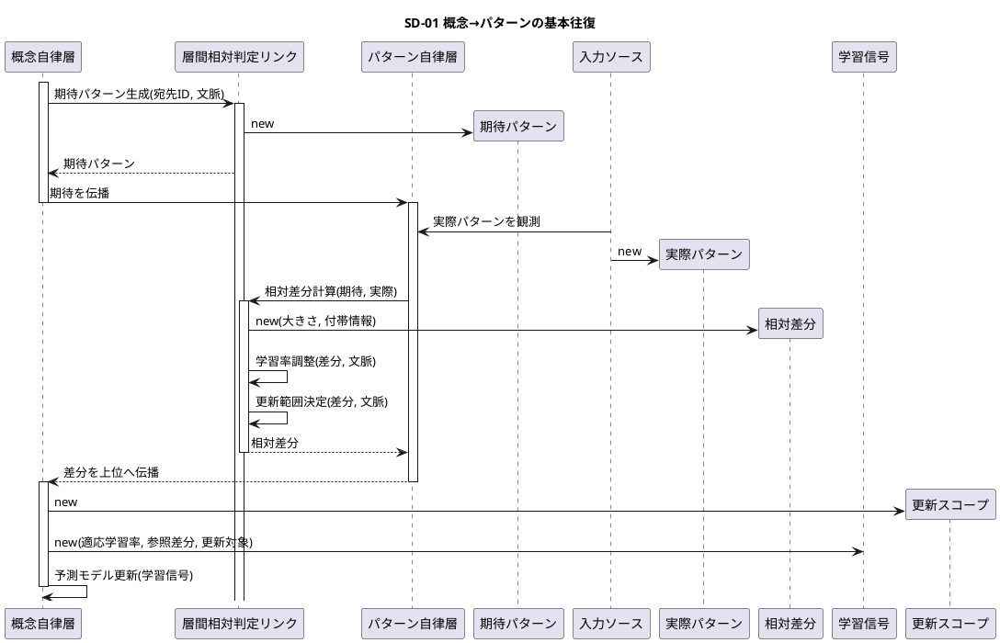

# SD-01 概念→パターンの基本往復

**目的**: Δ・η・スキップ算出→概念側更新

**登場クラス**: 
- `概念自律層`
- `パターン自律層`
- `層間相対判定リンク`
- `期待パターン`
- `実際パターン`
- `相対差分`
- `学習信号`
- `更新スコープ`

```plantuml
@startuml
title SD-01 概念→パターンの基本往復

participant "概念自律層" as ConceptLayer
participant "層間相対判定リンク" as Link
participant "パターン自律層" as PatternLayer

activate ConceptLayer
ConceptLayer -> Link: 期待パターン生成(宛先ID, 文脈)
activate Link

create "期待パターン" as ExpectedPattern
Link -> ExpectedPattern: new
Link --> ConceptLayer: 期待パターン

ConceptLayer -> PatternLayer: 期待を伝播
deactivate ConceptLayer
activate PatternLayer

' ... 実際パターンが観測される ...

participant "入力ソース" as InputSource
InputSource -> PatternLayer: 実際パターンを観測
create "実際パターン" as ActualPattern
InputSource -> ActualPattern: new

PatternLayer -> Link: 相対差分計算(期待, 実際)
activate Link
create "相対差分" as Delta
Link -> Delta: new(大きさ, 付帯情報)
Link -> Link: 学習率調整(差分, 文脈)
Link -> Link: 更新範囲決定(差分, 文脈)
Link --> PatternLayer: 相対差分
deactivate Link

PatternLayer --> ConceptLayer: 差分を上位へ伝播
deactivate PatternLayer
activate ConceptLayer

create "学習信号" as LearnSignal
create "更新スコープ" as UpdateScope
ConceptLayer -> UpdateScope: new
ConceptLayer -> LearnSignal: new(適応学習率, 参照差分, 更新対象)

ConceptLayer -> ConceptLayer: 予測モデル更新(学習信号)
deactivate ConceptLayer

@enduml
```
