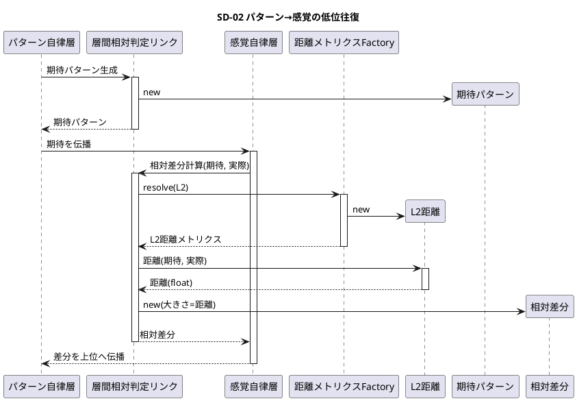

# SD-02 パターン→感覚の低位往復

**目的**: 低位での距離メトリクス選好

**登場クラス**: 
- `パターン自律層`
- `感覚自律層`
- `層間相対判定リンク`
- `差分距離メトリクス`
- `距離メトリクス種別`
- `距離メトリクスFactory`
- `L2距離`

```plantuml
@startuml
title SD-02 パターン→感覚の低位往復

participant "パターン自律層" as PatternLayer
participant "層間相対判定リンク" as Link
participant "感覚自律層" as SenseLayer
participant "距離メトリクスFactory" as MetricFactory
participant "L2距離" as L2Metric

PatternLayer -> Link: 期待パターン生成
activate Link
create "期待パターン" as ExpectedPattern
Link -> ExpectedPattern: new
Link --> PatternLayer: 期待パターン
deactivate Link

PatternLayer -> SenseLayer: 期待を伝播
activate SenseLayer

' ... 実際パターンが観測される ...
SenseLayer -> Link: 相対差分計算(期待, 実際)
activate Link

Link -> MetricFactory: resolve(L2)
activate MetricFactory
create L2Metric
MetricFactory -> L2Metric: new
MetricFactory --> Link: L2距離メトリクス
deactivate MetricFactory

Link -> L2Metric: 距離(期待, 実際)
activate L2Metric
L2Metric --> Link: 距離(float)
deactivate L2Metric

create "相対差分" as Delta
Link -> Delta: new(大きさ=距離)
Link --> SenseLayer: 相対差分
deactivate Link

SenseLayer --> PatternLayer: 差分を上位へ伝播
deactivate SenseLayer

@enduml
```
