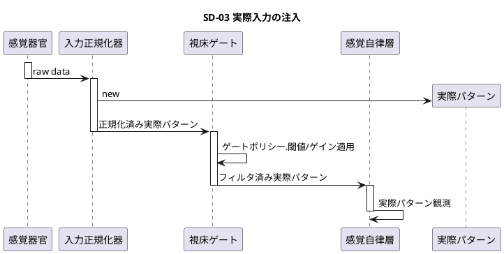

# SD-03 実際入力の注入（感覚器官→視床ゲート→感覚自律層）

**目的**: 予測フィルタリング経由で実世界入力を取り込む

**登場クラス**: 
- `感覚器官`
- `入力正規化器`
- `視床ゲート`
- `ゲートポリシー`
- `感覚自律層`
- `実際パターン`

```plantuml
@startuml
title SD-03 実際入力の注入

participant "感覚器官" as Sensor
participant "入力正規化器" as Normalizer
participant "視床ゲート" as ThalamusGate
participant "感覚自律層" as SenseLayer

activate Sensor
Sensor -> Normalizer: raw data
deactivate Sensor
activate Normalizer

create "実際パターン" as ActualPattern
Normalizer -> ActualPattern: new
Normalizer -> ThalamusGate: 正規化済み実際パターン
deactivate Normalizer
activate ThalamusGate

' ゲートポリシーに基づいてフィルタリング
ThalamusGate -> ThalamusGate: ゲートポリシー.閾値/ゲイン適用

ThalamusGate -> SenseLayer: フィルタ済み実際パターン
deactivate ThalamusGate
activate SenseLayer

SenseLayer -> SenseLayer: 実際パターン観測
deactivate SenseLayer

@enduml
```
