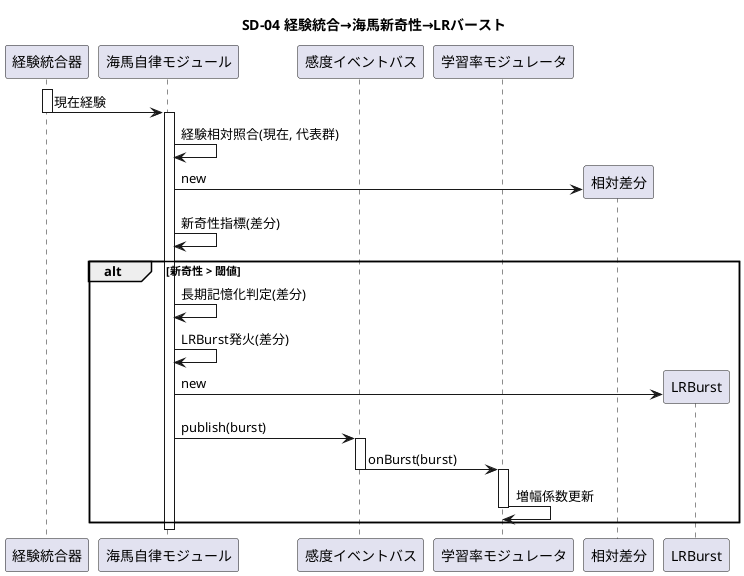

# SD-04 経験統合→海馬新奇性→LRバースト

**目的**: 経験統合・新奇性評価・感度上昇発火

**登場クラス**: 
- `経験統合器`
- `海馬自律モジュール`
- `現在経験`
- `代表経験集合`
- `相対差分`
- `LRBurst`
- `感度イベントバス`
- `学習率モジュレータ`

```plantuml
@startuml
title SD-04 経験統合→海馬新奇性→LRバースト

participant "経験統合器" as Integrator
participant "海馬自律モジュール" as Hippocampus
participant "感度イベントバス" as EventBus
participant "学習率モジュレータ" as LrModulator

activate Integrator
Integrator -> Hippocampus: 現在経験
deactivate Integrator
activate Hippocampus

Hippocampus -> Hippocampus: 経験相対照合(現在, 代表群)
create "相対差分" as Delta
Hippocampus -> Delta: new

Hippocampus -> Hippocampus: 新奇性指標(差分)

' 新奇性が高い場合
alt 新奇性 > 閾値
  Hippocampus -> Hippocampus: 長期記憶化判定(差分)
  Hippocampus -> Hippocampus: LRBurst発火(差分)
  create "LRBurst" as Burst
  Hippocampus -> Burst: new
  Hippocampus -> EventBus: publish(burst)
  activate EventBus
  EventBus -> LrModulator: onBurst(burst)
  deactivate EventBus
  activate LrModulator
  LrModulator -> LrModulator: 増幅係数更新
  deactivate LrModulator
end

deactivate Hippocampus

@enduml
```
