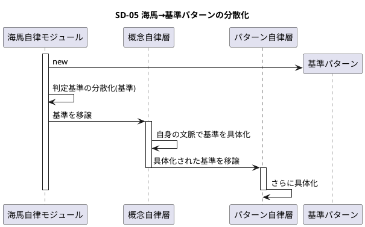

# SD-05 海馬→基準パターンの分散化

**目的**: 基準パターンを皮質各層へ段階移譲

**登場クラス**: 
- `海馬自律モジュール`
- `基準パターン`
- `自律層` (各層)

```plantuml
@startuml
title SD-05 海馬→基準パターンの分散化

participant "海馬自律モジュール" as Hippocampus
participant "概念自律層" as ConceptLayer
participant "パターン自律層" as PatternLayer

activate Hippocampus
create "基準パターン" as Criteria
Hippocampus -> Criteria: new

Hippocampus -> Hippocampus: 判定基準の分散化(基準)

' 階層的に基準を伝播・具体化
Hippocampus -> ConceptLayer: 基準を移譲
activate ConceptLayer
ConceptLayer -> ConceptLayer: 自身の文脈で基準を具体化
ConceptLayer -> PatternLayer: 具体化された基準を移譲
deactivate ConceptLayer
activate PatternLayer
PatternLayer -> PatternLayer: さらに具体化
deactivate PatternLayer

deactivate Hippocampus

@enduml
```
