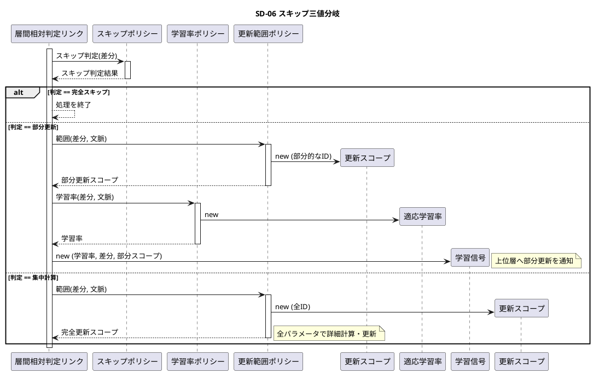

# SD-06 スキップ三値分岐

**目的**: 集中計算／部分更新／完全スキップの分岐

**登場クラス**:
- `層間相対判定リンク`
- `スキップポリシー`
- `スキップEnum`
- `学習率ポリシー`
- `更新範囲ポリシー`
- `更新スコープ`
- `学習信号`

```plantuml
@startuml
title SD-06 スキップ三値分岐

participant "層間相対判定リンク" as Link
participant "スキップポリシー" as SkipPolicy
participant "学習率ポリシー" as LrPolicy
participant "更新範囲ポリシー" as ScopePolicy

activate Link
Link -> SkipPolicy: スキップ判定(差分)
activate SkipPolicy

' 差分の大きさに応じて分岐
' スキップEnum (集中計算, 部分更新, 完全スキップ)
SkipPolicy --> Link: スキップ判定結果
deactivate SkipPolicy

alt 判定 == 完全スキップ
    Link --> Link: 処理を終了
else 判定 == 部分更新
    Link -> ScopePolicy: 範囲(差分, 文脈)
    activate ScopePolicy
    create "更新スコープ" as UpdateScope
    ScopePolicy -> UpdateScope: new (部分的なID)
    ScopePolicy --> Link: 部分更新スコープ
    deactivate ScopePolicy
    
    Link -> LrPolicy: 学習率(差分, 文脈)
    activate LrPolicy
    create "適応学習率" as Lr
    LrPolicy -> Lr: new
    LrPolicy --> Link: 学習率
    deactivate LrPolicy
    
    create "学習信号" as LearnSignal
    Link -> LearnSignal: new (学習率, 差分, 部分スコープ)
    note right: 上位層へ部分更新を通知
else 判定 == 集中計算
    Link -> ScopePolicy: 範囲(差分, 文脈)
    activate ScopePolicy
    create "更新スコープ" as FullUpdateScope
    ScopePolicy -> FullUpdateScope: new (全ID)
    ScopePolicy --> Link: 完全更新スコープ
    deactivate ScopePolicy
    
    ' ... 学習率計算と学習信号生成 ...
    note right: 全パラメータで詳細計算・更新
end

deactivate Link

@enduml
```
