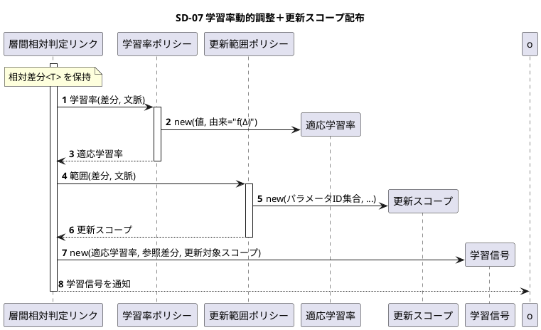

# SD-07 学習率動的調整＋更新スコープ配布

**目的**: η=f(Δ) と更新対象の同報

**登場クラス**:
- `層間相対判定リンク`
- `学習率ポリシー`
- `更新範囲ポリシー`
- `相対差分`
- `適応学習率`
- `更新スコープ`
- `学習信号`

```plantuml
@startuml
title SD-07 学習率動的調整＋更新スコープ配布

participant "層間相対判定リンク" as Link
participant "学習率ポリシー" as LrPolicy
participant "更新範囲ポリシー" as ScopePolicy

autonumber
activate Link

' 前提：相対差分は計算済み
note over Link: 相対差分<T> を保持

Link -> LrPolicy: 学習率(差分, 文脈)
activate LrPolicy
create "適応学習率" as Lr
LrPolicy -> Lr: new(値, 由来="f(Δ)")
LrPolicy --> Link: 適応学習率
deactivate LrPolicy

Link -> ScopePolicy: 範囲(差分, 文脈)
activate ScopePolicy
create "更新スコープ" as Scope
ScopePolicy -> Scope: new(パラメータID集合, ...)
ScopePolicy --> Link: 更新スコープ
deactivate ScopePolicy

create "学習信号" as LearnSignal
Link -> LearnSignal: new(適応学習率, 参照差分, 更新対象スコープ)

Link -->o: 学習信号を通知
deactivate Link

@enduml
```
