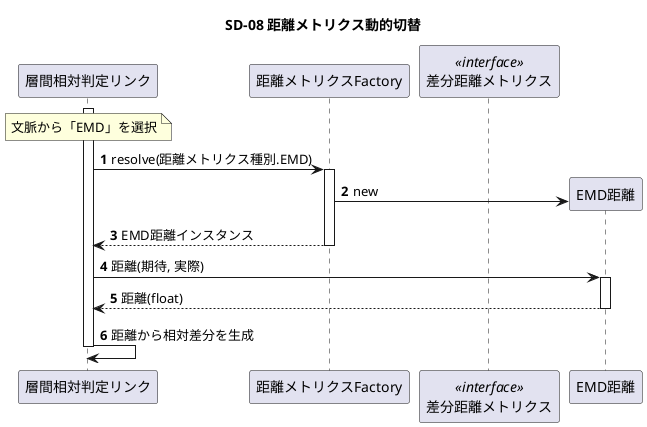

# SD-08 距離メトリクス動的切替

**目的**: 文脈により L2/コサイン/KL/EMD を切替

**登場クラス**:
- `差分距離メトリクス`
- `距離メトリクス種別`
- `距離メトリクスFactory`
- `層間相対判定リンク`
- `EMD距離` (例)

```plantuml
@startuml
title SD-08 距離メトリクス動的切替

participant "層間相対判定リンク" as Link
participant "距離メトリクスFactory" as Factory
participant "差分距離メトリクス" as Metric <<interface>>
participant "EMD距離" as EMDMetric

autonumber
activate Link

' 文脈に応じて使用するメトリクスを決定
note over Link: 文脈から「EMD」を選択

Link -> Factory: resolve(距離メトリクス種別.EMD)
activate Factory
create EMDMetric
Factory -> EMDMetric: new
Factory --> Link: EMD距離インスタンス
deactivate Factory

Link -> EMDMetric: 距離(期待, 実際)
activate EMDMetric
EMDMetric --> Link: 距離(float)
deactivate EMDMetric

Link -> Link: 距離から相対差分を生成

deactivate Link

@enduml
```
