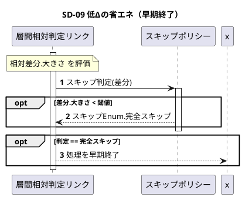

# SD-09 低Δの省エネ（早期終了）

**目的**: Δ<τ で即スキップ

**登場クラス**:
- `層間相対判定リンク`
- `スキップポリシー`
- `スキップEnum`

```plantuml
@startuml
title SD-09 低Δの省エネ（早期終了）

participant "層間相対判定リンク" as Link
participant "スキップポリシー" as SkipPolicy

autonumber
activate Link

' 前提：相対差分は計算済み
note over Link: 相対差分.大きさ を評価

Link -> SkipPolicy: スキップ判定(差分)
activate SkipPolicy

' 差分が閾値より小さい場合
opt 差分.大きさ < 閾値
    SkipPolicy --> Link: スキップEnum.完全スキップ
end

deactivate SkipPolicy

' 判定結果が「完全スキップ」なら処理を打ち切る
opt 判定 == 完全スキップ
    Link -->x: 処理を早期終了
end

deactivate Link

@enduml
```
