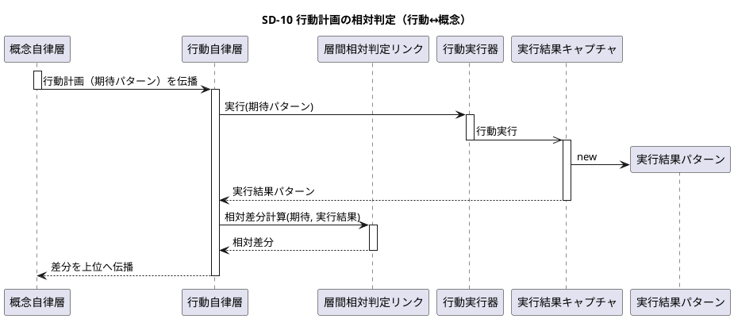

# SD-10 行動計画の相対判定（行動↔概念）

**目的**: 期待結果 vs 実行結果の誤差学習

**登場クラス**:
- `行動自律層`
- `概念自律層`
- `層間相対判定リンク`
- `行動実行器`
- `実行結果キャプチャ`
- `実行結果パターン`

```plantuml
@startuml
title SD-10 行動計画の相対判定（行動↔概念）

participant "概念自律層" as ConceptLayer
participant "行動自律層" as ActionLayer
participant "層間相対判定リンク" as Link
participant "行動実行器" as Actuator
participant "実行結果キャプチャ" as Capture

activate ConceptLayer
ConceptLayer -> ActionLayer: 行動計画（期待パターン）を伝播
deactivate ConceptLayer
activate ActionLayer

ActionLayer -> Actuator: 実行(期待パターン)
activate Actuator
Actuator ->> Capture: 行動実行
deactivate Actuator

activate Capture
create "実行結果パターン" as ResultPattern
Capture -> ResultPattern: new
Capture --> ActionLayer: 実行結果パターン
deactivate Capture

ActionLayer -> Link: 相対差分計算(期待, 実行結果)
activate Link
Link --> ActionLayer: 相対差分
deactivate Link

ActionLayer --> ConceptLayer: 差分を上位へ伝播
deactivate ActionLayer

@enduml
```
