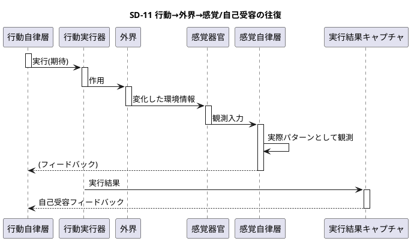

# SD-11 行動→外界→感覚/自己受容の往復

**目的**: 外界変化と自己受容を両経路で取り込む

**登場クラス**:
- `行動実行器`
- `外界`
- `感覚器官`
- `実行結果キャプチャ`
- `行動自律層`
- `感覚自律層`

```plantuml
@startuml
title SD-11 行動→外界→感覚/自己受容の往復

participant "行動自律層" as ActionLayer
participant "行動実行器" as Actuator
participant "外界" as World
participant "感覚器官" as Sensor
participant "感覚自律層" as SenseLayer

activate ActionLayer
ActionLayer -> Actuator: 実行(期待)
deactivate ActionLayer

activate Actuator
Actuator -> World: 作用
deactivate Actuator

activate World
World -> Sensor: 変化した環境情報
deactivate World

activate Sensor
Sensor -> SenseLayer: 観測入力
deactivate Sensor

activate SenseLayer
SenseLayer -> SenseLayer: 実際パターンとして観測
' この実際パターンが感覚層の期待と比較される
SenseLayer --> ActionLayer: (フィードバック)
deactivate SenseLayer

' 自己受容感覚のフィードバック
participant "実行結果キャプチャ" as Proprioception
Actuator -> Proprioception: 実行結果
activate Proprioception
Proprioception --> ActionLayer: 自己受容フィードバック
deactivate Proprioception

@enduml
```
