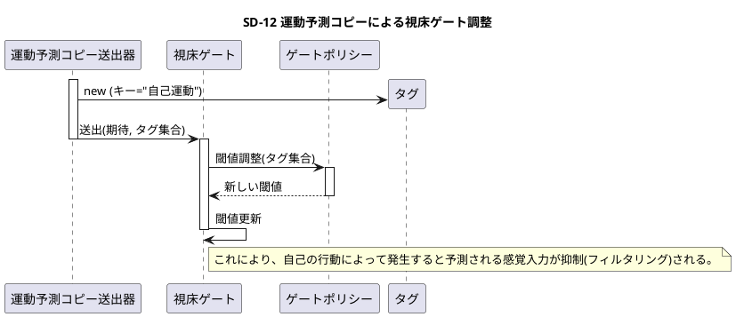

# SD-12 運動予測コピーによる視床ゲート調整

**目的**: 自己起因入力の抑制・先回りゲーティング

**登場クラス**:
- `運動予測コピー送出器`
- `視床ゲート`
- `ゲートポリシー`
- `タグ`

```plantuml
@startuml
title SD-12 運動予測コピーによる視床ゲート調整

participant "運動予測コピー送出器" as EfferenceCopy
participant "視床ゲート" as ThalamusGate
participant "ゲートポリシー" as GatePolicy

activate EfferenceCopy

' 行動層が生成した期待パターンに基づいてコピーを送出
create "タグ" as Tag
EfferenceCopy -> Tag: new (キー="自己運動")
EfferenceCopy -> ThalamusGate: 送出(期待, タグ集合)
deactivate EfferenceCopy

activate ThalamusGate
ThalamusGate -> GatePolicy: 閾値調整(タグ集合)
activate GatePolicy
' タグを見て、自己運動に由来する感覚の閾値を上げる
GatePolicy --> ThalamusGate: 新しい閾値
deactivate GatePolicy

ThalamusGate -> ThalamusGate: 閾値更新

note right of ThalamusGate: これにより、自己の行動によって発生すると予測される感覚入力が抑制(フィルタリング)される。

deactivate ThalamusGate

@enduml
```
