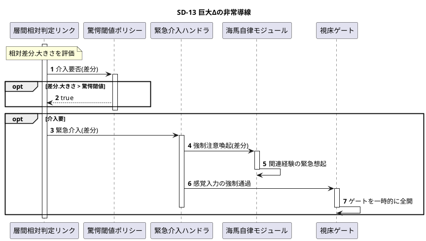

# SD-13 巨大Δの非常導線（驚愕→介入）

**目的**: 通常経路を飛ばして海馬/視床へ介入

**登場クラス**:
- `層間相対判定リンク`
- `驚愕閾値ポリシー`
- `緊急介入ハンドラ`
- `海馬自律モジュール`
- `視床ゲート`

```plantuml
@startuml
title SD-13 巨大Δの非常導線

participant "層間相対判定リンク" as Link
participant "驚愕閾値ポリシー" as Policy
participant "緊急介入ハンドラ" as Handler
participant "海馬自律モジュール" as Hippocampus
participant "視床ゲート" as ThalamusGate

autonumber
activate Link

' 前提：相対差分は計算済み
note over Link: 相対差分.大きさを評価

Link -> Policy: 介入要否(差分)
activate Policy
opt 差分.大きさ > 驚愕閾値
    Policy --> Link: true
end
deactivate Policy

opt 介入要
    Link -> Handler: 緊急介入(差分)
    activate Handler
    Handler -> Hippocampus: 強制注意喚起(差分)
    activate Hippocampus
    Hippocampus -> Hippocampus: 関連経験の緊急想起
    deactivate Hippocampus
    
    Handler -> ThalamusGate: 感覚入力の強制通過
    activate ThalamusGate
    ThalamusGate -> ThalamusGate: ゲートを一時的に全開
    deactivate ThalamusGate
    
deactivate Handler
end

deactivate Link

@enduml
```
