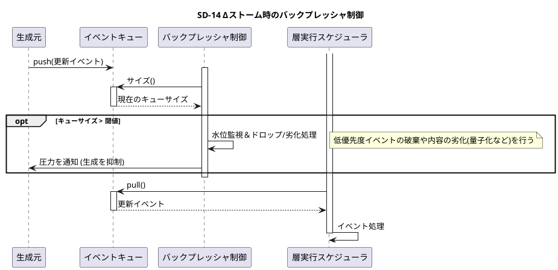

# SD-14 Δストーム時のバックプレッシャ制御

**目的**: イベント輻輳の抑制と優先度制御

**登場クラス**:
- `更新イベント`
- `イベントキュー`
- `優先度`
- `バックプレッシャ制御`
- `層実行スケジューラ`

```plantuml
@startuml
title SD-14 Δストーム時のバックプレッシャ制御

participant "生成元" as Source
participant "イベントキュー" as Queue
participant "バックプレッシャ制御" as Backpressure
participant "層実行スケジューラ" as Scheduler

Source -> Queue: push(更新イベント)

activate Backpressure
Backpressure -> Queue: サイズ()
activate Queue
Queue --> Backpressure: 現在のキューサイズ
deactivate Queue

opt キューサイズ > 閾値
    Backpressure -> Backpressure: 水位監視＆ドロップ/劣化処理
    note right: 低優先度イベントの破棄や内容の劣化(量子化など)を行う
    Backpressure -> Source: 圧力を通知 (生成を抑制)
end
deactivate Backpressure

activate Scheduler
Scheduler -> Queue: pull()
activate Queue
Queue --> Scheduler: 更新イベント
deactivate Queue
Scheduler -> Scheduler: イベント処理
deactivate Scheduler

@enduml
```
