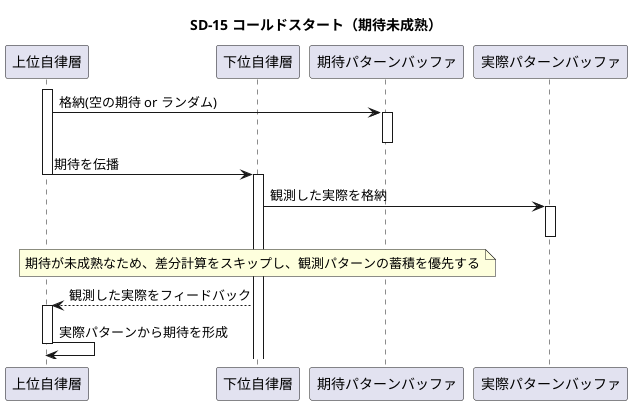

# SD-15 コールドスタート（期待未成熟）

**目的**: 初期往復で期待分布を形成

**登場クラス**:
- `自律層`（任意の上下）
- `層間相対判定リンク`
- `期待パターン`
- `実際パターン`
- `期待パターンバッファ`
- `実際パターンバッファ`

```plantuml
@startuml
title SD-15 コールドスタート（期待未成熟）

participant "上位自律層" as UpperLayer
participant "下位自律層" as LowerLayer
participant "期待パターンバッファ" as ExpectedBuffer
participant "実際パターンバッファ" as ActualBuffer

activate UpperLayer
' 最初は期待が何もない
UpperLayer -> ExpectedBuffer: 格納(空の期待 or ランダム)
activate ExpectedBuffer
deactivate ExpectedBuffer

UpperLayer -> LowerLayer: 期待を伝播
deactivate UpperLayer
activate LowerLayer

' 実際が入力される
LowerLayer -> ActualBuffer: 観測した実際を格納
activate ActualBuffer
deactivate ActualBuffer

' 期待と実際が揃っていないので、差分は計算せずバッファリングに専念
note over LowerLayer: 期待が未成熟なため、差分計算をスキップし、観測パターンの蓄積を優先する

LowerLayer --> UpperLayer: 観測した実際をフィードバック

activate UpperLayer
' 上位層は受け取った実際を元に、次の期待を形成し始める
UpperLayer -> UpperLayer: 実際パターンから期待を形成
deactivate UpperLayer

@enduml
```
