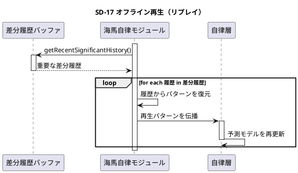

# SD-17 オフライン再生（リプレイ）

**目的**: 履歴の再生で基準・重みを安定化

**登場クラス**:
- `差分履歴バッファ`
- `海馬自律モジュール`
- `自律層`（各層）

```plantuml
@startuml
title SD-17 オフライン再生（リプレイ）

participant "差分履歴バッファ" as HistoryBuffer
participant "海馬自律モジュール" as Hippocampus
participant "自律層" as Layer

' アイドル時などにリプレイを開始
activate Hippocampus
Hippocampus -> HistoryBuffer: getRecentSignificantHistory()
activate HistoryBuffer
HistoryBuffer --> Hippocampus: 重要な差分履歴
deactivate HistoryBuffer

loop for each 履歴 in 差分履歴
    ' 履歴から期待と実際を復元
    Hippocampus -> Hippocampus: 履歴からパターンを復元
    
    ' 復元したパターンを各層に流して再計算させる
    Hippocampus -> Layer: 再生パターンを伝播
    activate Layer
    Layer -> Layer: 予測モデルを再更新
    deactivate Layer
end

deactivate Hippocampus

@enduml
```
