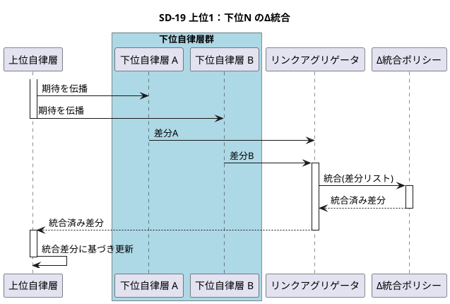

# SD-19 上位1：下位N のΔ統合

**目的**: 複数下位の実際を統合しΔ決定

**登場クラス**:
- `リンクアグリゲータ`
- `Δ統合ポリシー`
- `上位自律層`
- `下位自律層群`
- `層間相対判定リンク`

```plantuml
@startuml
title SD-19 上位1：下位N のΔ統合

participant "上位自律層" as UpperLayer
box "下位自律層群" #LightBlue
    participant "下位自律層 A" as LowerA
    participant "下位自律層 B" as LowerB
end box
participant "リンクアグリゲータ" as Aggregator
participant "Δ統合ポリシー" as Policy

activate UpperLayer
UpperLayer -> LowerA: 期待を伝播
UpperLayer -> LowerB: 期待を伝播
deactivate UpperLayer

' 各下位層で実際が観測され、差分が計算される
LowerA -> Aggregator: 差分A
LowerB -> Aggregator: 差分B

activate Aggregator
Aggregator -> Policy: 統合(差分リスト)
activate Policy
Policy --> Aggregator: 統合済み差分
deactivate Policy

Aggregator --> UpperLayer: 統合済み差分
deactivate Aggregator

activate UpperLayer
UpperLayer -> UpperLayer: 統合差分に基づき更新
deactivate UpperLayer

@enduml
```
