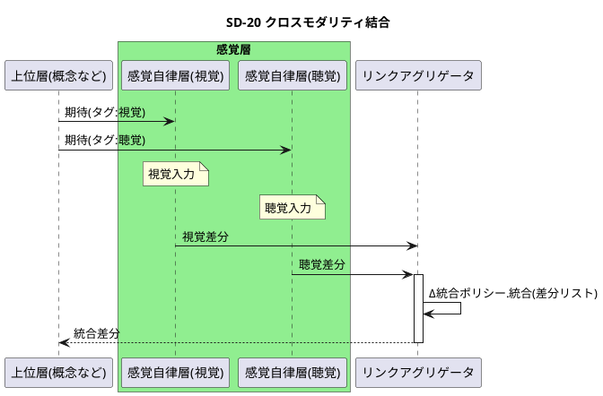

# SD-20 クロスモダリティ結合（視覚×聴覚 等）

**目的**: 異モダリティ間のΔ整合

**登場クラス**:
- `感覚自律層`（複数）
- `リンクアグリゲータ`
- `Δ統合ポリシー`
- `タグ`

```plantuml
@startuml
title SD-20 クロスモダリティ結合

participant "上位層(概念など)" as UpperLayer
box "感覚層" #LightGreen
    participant "感覚自律層(視覚)" as VisionLayer
    participant "感覚自律層(聴覚)" as AudioLayer
end box
participant "リンクアグリゲータ" as Aggregator

UpperLayer -> VisionLayer: 期待(タグ:視覚)
UpperLayer -> AudioLayer: 期待(タグ:聴覚)

' 実際入力
note over VisionLayer: 視覚入力
note over AudioLayer: 聴覚入力

VisionLayer -> Aggregator: 視覚差分
AudioLayer -> Aggregator: 聴覚差分

activate Aggregator
' タグを見て、クロスモーダルなΔ統合ポリシーを適用
Aggregator -> Aggregator: Δ統合ポリシー.統合(差分リスト)
Aggregator --> UpperLayer: 統合差分
deactivate Aggregator

@enduml
```
