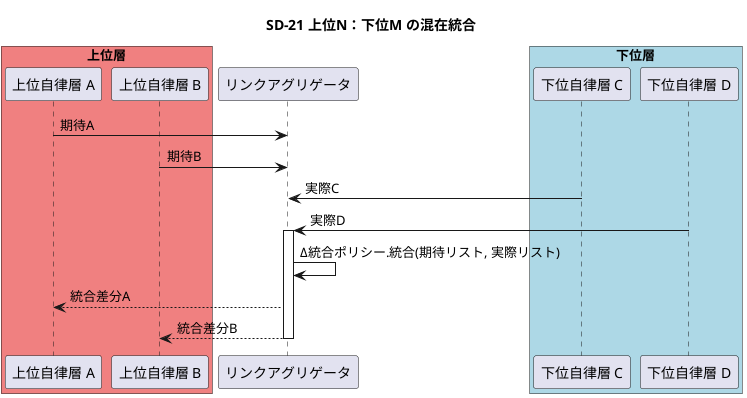

# SD-21 上位N：下位M の混在統合

**目的**: 複数上位期待と複数下位実際の相互整合

**登場クラス**:
- `リンクアグリゲータ`
- `Δ統合ポリシー`
- `自律層`（複数）
- `層間相対判定リンク`（複数）

```plantuml
@startuml
title SD-21 上位N：下位M の混在統合

box "上位層" #LightCoral
    participant "上位自律層 A" as UpperA
    participant "上位自律層 B" as UpperB
end box
participant "リンクアグリゲータ" as Aggregator
box "下位層" #LightBlue
    participant "下位自律層 C" as LowerC
    participant "下位自律層 D" as LowerD
end box

UpperA -> Aggregator: 期待A
UpperB -> Aggregator: 期待B

LowerC -> Aggregator: 実際C
LowerD -> Aggregator: 実際D

activate Aggregator
Aggregator -> Aggregator: Δ統合ポリシー.統合(期待リスト, 実際リスト)

Aggregator --> UpperA: 統合差分A
Aggregator --> UpperB: 統合差分B
deactivate Aggregator

@enduml
```
