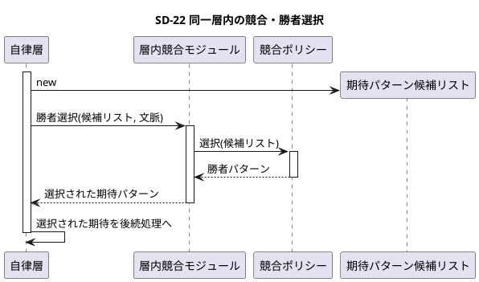

# SD-22 同一層内の競合・勝者選択

**目的**: 同層内の候補から代表解を選ぶ

**登場クラス**:
- `層内競合モジュール`
- `競合ポリシー`
- `期待パターン`
- `付帯情報`

```plantuml
@startuml
title SD-22 同一層内の競合・勝者選択

participant "自律層" as Layer
participant "層内競合モジュール" as Competition
participant "競合ポリシー" as Policy

activate Layer
' 複数の期待パターン候補が生成される
create "期待パターン候補リスト" as Candidates
Layer -> Candidates: new

Layer -> Competition: 勝者選択(候補リスト, 文脈)
activate Competition

Competition -> Policy: 選択(候補リスト)
activate Policy
Policy --> Competition: 勝者パターン
deactivate Policy

Competition --> Layer: 選択された期待パターン
deactivate Competition

Layer -> Layer: 選択された期待を後続処理へ
deactivate Layer

@enduml
```
