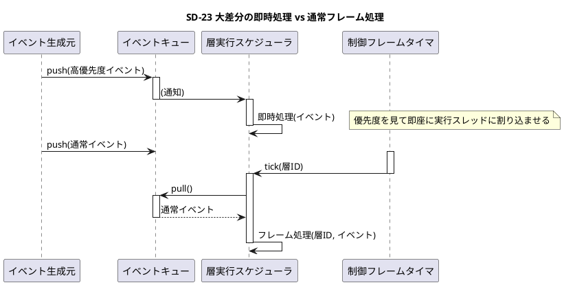

# SD-23 大差分の即時処理 vs 通常フレーム処理

**目的**: ハイブリッド基盤の分岐（割込み/次フレーム）

**登場クラス**:
- `更新イベント`
- `イベントキュー`
- `層実行スケジューラ`
- `制御フレームタイマ`

```plantuml
@startuml
title SD-23 大差分の即時処理 vs 通常フレーム処理

participant "イベント生成元" as Source
participant "イベントキュー" as Queue
participant "層実行スケジューラ" as Scheduler
participant "制御フレームタイマ" as Timer

' --- 大差分イベント (高優先度) ---
Source -> Queue: push(高優先度イベント)
activate Queue
Queue -> Scheduler: (通知)
deactivate Queue

activate Scheduler
Scheduler -> Scheduler: 即時処理(イベント)
note right: 優先度を見て即座に実行スレッドに割り込ませる
deactivate Scheduler

' --- 通常イベント (中/低優先度) ---
Source -> Queue: push(通常イベント)

' --- フレーム処理 ---
activate Timer
Timer -> Scheduler: tick(層ID)
deactivate Timer

activate Scheduler
Scheduler -> Queue: pull()
activate Queue
Queue --> Scheduler: 通常イベント
deactivate Queue

Scheduler -> Scheduler: フレーム処理(層ID, イベント)
deactivate Scheduler

@enduml
```
