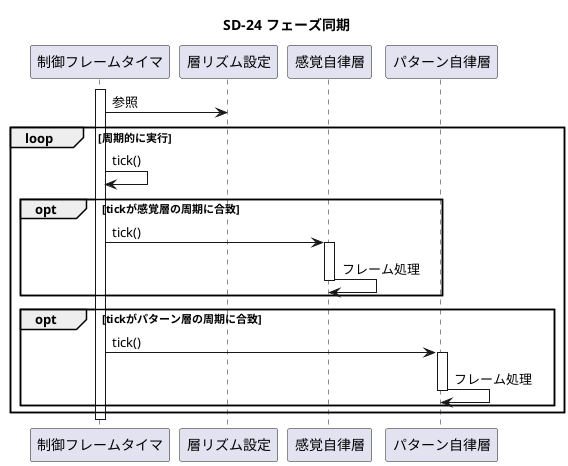

# SD-24 フェーズ同期（層ごとの位相合わせ）

**目的**: 層リズム設定に基づく緩やかな同期

**登場クラス**:
- `制御フレームタイマ`
- `層リズム設定`
- `自律層`（複数）

```plantuml
@startuml
title SD-24 フェーズ同期

participant "制御フレームタイマ" as Timer
participant "層リズム設定" as RhythmConfig
participant "感覚自律層" as SenseLayer
participant "パターン自律層" as PatternLayer

activate Timer
Timer -> RhythmConfig: 参照

' タイマーが設定に基づいてtickを発行
loop 周期的に実行
    Timer -> Timer: tick()
    
    ' 感覚層のタイミング
    opt tickが感覚層の周期に合致
        Timer -> SenseLayer: tick()
        activate SenseLayer
        SenseLayer -> SenseLayer: フレーム処理
        deactivate SenseLayer
    end
    
    ' パターン層のタイミング
    opt tickがパターン層の周期に合致
        Timer -> PatternLayer: tick()
        activate PatternLayer
        PatternLayer -> PatternLayer: フレーム処理
        deactivate PatternLayer
    end
end

deactivate Timer

@enduml
```
