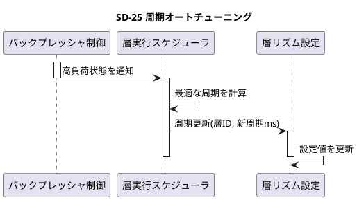

# SD-25 周期オートチューニング

**目的**: 負荷と精度に応じ周期msを調整

**登場クラス**:
- `バックプレッシャ制御`
- `層実行スケジューラ`
- `層リズム設定`

```plantuml
@startuml
title SD-25 周期オートチューニング

participant "バックプレッシャ制御" as Backpressure
participant "層実行スケジューラ" as Scheduler
participant "層リズム設定" as RhythmConfig

' 高負荷状態を検知
activate Backpressure
Backpressure -> Scheduler: 高負荷状態を通知
deactivate Backpressure

activate Scheduler
' スケジューラは負荷情報と、処理の精度（例：差分の大きさ）を考慮
Scheduler -> Scheduler: 最適な周期を計算

Scheduler -> RhythmConfig: 周期更新(層ID, 新周期ms)
activate RhythmConfig
RhythmConfig -> RhythmConfig: 設定値を更新
deactivate RhythmConfig

deactivate Scheduler

@enduml
```
