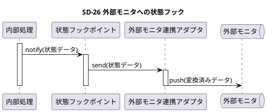

# SD-26 外部モニタへの状態フック

**目的**: 内部状態を外部ツールで可視化・分析

**登場クラス**:
- `状態フックポイント`
- `外部モニタ連携アダプタ`
- `外部モニタ`

```plantuml
@startuml
title SD-26 外部モニタへの状態フック

participant "内部処理" as InternalProcess
participant "状態フックポイント" as HookPoint
participant "外部モニタ連携アダプタ" as Adapter
queue "外部モニタ" as Monitor

activate InternalProcess

' 処理の途中でフックポイントを呼び出す
InternalProcess -> HookPoint: notify(状態データ)
activate HookPoint

HookPoint -> Adapter: send(状態データ)
activate Adapter

' アダプタが外部モニタの形式に変換して送信
Adapter -> Monitor: push(変換済みデータ)
deactivate Adapter

deactivate HookPoint
deactivate InternalProcess

@enduml
```
