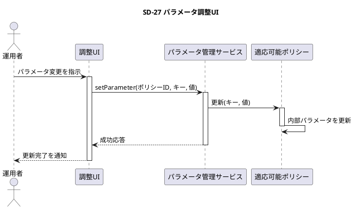

# SD-27 パラメータ調整UI

**目的**: 実行中に主要パラメータを外部から調整

**登場クラス**:
- `調整UI`
- `パラメータ管理サービス`
- `適応可能ポリシー`

```plantuml
@startuml
title SD-27 パラメータ調整UI

actor "運用者" as Operator
participant "調整UI" as UI
participant "パラメータ管理サービス" as ParamService
participant "適応可能ポリシー" as TargetPolicy

Operator -> UI: パラメータ変更を指示

activate UI
UI -> ParamService: setParameter(ポリシーID, キー, 値)
activate ParamService

ParamService -> TargetPolicy: 更新(キー, 値)
activate TargetPolicy
TargetPolicy -> TargetPolicy: 内部パラメータを更新
deactivate TargetPolicy

ParamService --> UI: 成功応答
deactivate ParamService

UI --> Operator: 更新完了を通知
deactivate UI

@enduml
```
